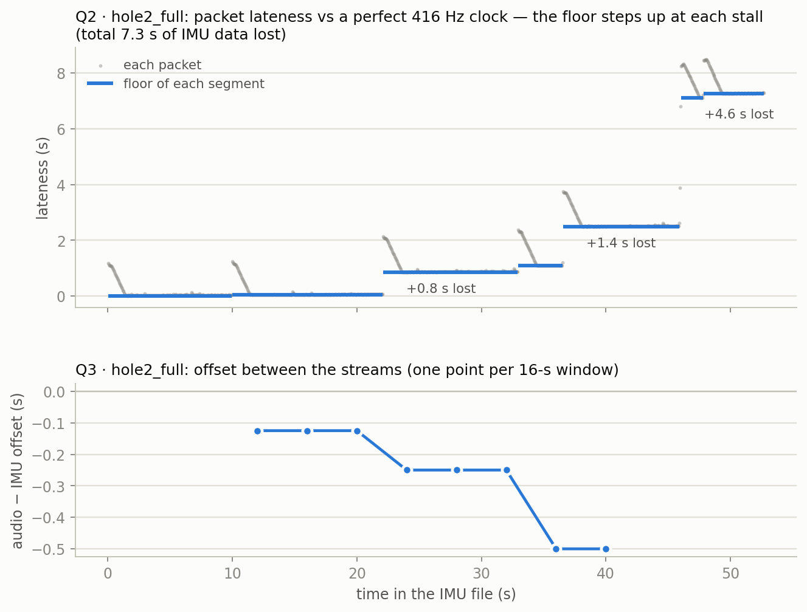

# Synchronisation checks: method, reasoning and results

Written 2026-10-04. Code: `src/sync_checks.py` (tested in `tests/test_sync_checks.py`).
Runners: `scripts/run_sync_checks.py` and `scripts/plot_sync_example.py`. Decisions that follow
from this document: `docs/DECISIONS.md` D5–D7.

## Summary

- **Q1 (packet continuity): all 24 recordings pass.** This was expected: the link is TCP, which
  never loses packets, so Q1 really checks the laptop receiver.
- **Q2 (hidden gaps): the IMU data has hidden holes.** During WiFi stalls longer than ~1.25 s,
  the board throws samples away *before* numbering them, so the files look complete but are
  not. Per recording, between 0 and 7.3 s is missing (up to 45 % of one short crop). We can now
  say **where** each hole is (to within 48 ms) and **how big** it is.
- **About 21 % of 3-second windows contain a hole.** The share differs by campaign and label
  (15–30 %), so holes are a potential shortcut for a model and must be handled before training.
- **Q3 (audio–IMU alignment): the two streams are not aligned.** Their offset reaches ±1.4 s
  and changes by up to 0.5 s within a recording. Both streams lose data at the same stalls,
  but the microphone's smaller buffer makes it lose slightly more each time.
- **The measurements agree with each other.** Q3's offsets match the loss difference between
  the streams (r = 0.89 over 14 recordings), and every Q2 number matches the firmware's queue
  sizes. Nothing here rests on one measurement alone.

---

## 1. Why these checks exist

Every later step assumes three things about the data:

1. **Nothing went missing:** every sample the sensor measured is in the file.
2. **The clock is right:** IMU row *i* happened at *i* / 416 s, audio sample *j* at *j* / 16000 s.
3. **The streams line up:** second 30 of the IMU file and second 30 of the WAV describe the same
   moment.

A model never checks these. It cuts windows by counting rows and pairs IMU window *k* with audio
window *k*. If an assumption fails, a window can glue together two moments that are seconds
apart, or pair motion from one moment with sound from another. Worse, the model can learn those
artefacts instead of wing damage. Each check below tests one assumption.

## 2. What the firmware does (the cause)

Read in `microcontroller-firmware/src/`; full detail in `docs/DECISIONS.md` D5.

- The IMU task pushes each sample into a **512-sample queue** (1.23 s at 416 Hz) and **drops it
  silently if the queue is full** (`imu_driver.c:97`). The microphone does the same with a
  64 × 256-sample queue (**1.02 s** at 16 kHz, `mic_driver.c:83`).
- Packet numbers are assigned only *after* the queues (`main.c:123`, `main.c:149`), when 20 IMU
  samples are bundled. A dropped sample therefore leaves no trace in `Packet_ID`.
- When WiFi stalls, the sending loop blocks, both queues fill up, and from then on new samples
  are discarded until WiFi recovers.

---

## 3. Q1: are any packets missing?

**Idea.** Collapse runs of equal `Packet_ID` into packets (run-length encoding). Check that each
interior packet has 20 rows and that IDs step by exactly 1.

**Function:** `packet_continuity(packet_ids)`, written by Marco.

**Result.** All 24 recordings pass: every interior packet holds 20 samples, with no lost or
reordered packets. Partial first/last packets occur only in cropped files, where the crop cut
through a packet.

**Bonus: crop starts from packet IDs.** The counter starts at 0 when recording begins, so a
cropped file's first packet ID and the size of its first packet give the crop start row:
20 × ID + (20 − first size). This predicted the crop start of all 10 cropped recordings (5 per
campaign) exactly, as later confirmed against the originals.

---

## 4. Q2: where are the hidden gaps, and how big?

### Idea

For every packet, ask: *how late did it arrive compared with a perfect 416 Hz clock?* If nothing
is lost, this lateness stays at a flat floor. When samples are dropped, every later packet looks
later by exactly the missing time, so **the floor steps up and stays up**.

### Math

Packet *k* has receive time tₖ (`Rx_Time_Sec`; all 20 rows of a packet share it) and last sample
index iₖ. Its lateness is

  rₖ = tₖ − iₖ / 416 = (time lost so far) + (delay of this packet).

Network delay is **one-sided**: a packet can arrive late, never early. That's why each stretch
between stalls (a *segment*) is summarised by its **minimum** lateness, the *floor*, and not by
its mean. My first prototype used a least-squares mean, and backlog bursts made it noisy
(100–200 ms scatter).

### Procedure: `hidden_gaps(packet_ids, rx_times)`

1. **Packets:** one receive time and one last-sample index per packet.
2. **Lateness:** rₖ for every packet.
3. **Segments:** start a new segment after every arrival gap longer than 0.5 s (a *stall*).
   Normal packet spacing is 48 ms (20 / 416 s). Every stall lasted more than 1 s, except two
   gaps of 0.50 and 0.52 s: the first lost 0.03 s and the second is part of a burst (step 4).
   Any threshold between 0.5 and 1 s gives essentially the same result.
4. **Bursts.** After a stall, the backlog takes about 26 packets to drain. A segment with fewer
   than 30 packets therefore never reaches its true floor. Such a segment is skipped, and the
   stalls on either side of it form **one event**, measured between the long segments around it.
   15 of the 111 events are bursts.
5. **Floor and loss.** Each long segment's floor is its minimum lateness. An event's lost time is
   the floor after it minus the floor before it.
6. **Where the gap sits.** After a stall the board first sends its queued backlog (old samples,
   very late), then fresh samples (on the new floor). The dropped samples sit between the two, so
   the gap is located at the first packet within 0.05 s of the new floor (±1 packet = ±48 ms). In
   a burst, this locates the *last* gap of the event.



*Top: each grey dot is a packet. The diagonal streaks are backlogs arriving in a burst after each
stall; the blue floor steps up by the time lost (labels at the located gaps; "+4.6 s" is a burst
of three stalls). Bottom: the Q3 offset for the same recording steps down at the same moments.*

### Validation

- **Toy tests.** Two hand-built streams reproduce the firmware's queue mechanism at small scale:
  a single stall, and a burst of two. Q2 recovers the exact number of dropped samples and the
  exact gap position in both. (Without the burst rule, the burst test fails: the loss came out as
  0.40 s instead of 0.70 s.)
- **The backlog height equals the IMU queue.** In the figure, every diagonal streak is about 1.2 s
  tall, matching the 512-sample queue (1.23 s).
- **The lost time follows the queue model.** For single-stall events:

  | Stall duration | n | Median lost | Median (duration − lost) |
  |---|:--:|:--:|:--:|
  | 1.00–1.25 s | 26 | 0.01 s | 1.12 s |
  | 1.25–1.50 s | 44 | 0.09 s | 1.27 s |
  | 1.50–2.00 s | 20 | 0.31 s | 1.29 s |
  | 2.00–4.00 s | 4 | 0.88 s | 1.31 s |

  Short stalls lose nothing, because the queue absorbs them. Longer stalls lose their duration
  minus a steady ~1.3 s: the 1.23 s queue plus a little WiFi send buffer.
- **The located gaps sit where the model predicts.** In 58 single-stall lossy events, the gap sits
  a median **1.45 s** of data after the stall began (interquartile range 1.45–1.49 s). That's the
  queue plus about 0.2 s held in the send buffer.
- **The totals agree with an independent estimate.** Total lost time matches (receive-time span −
  rows / 416) to within 0.1 s in 13 of 14 uncropped recordings. The exception, `hole2_full`
  (7.25 vs 6.04 s), started with a 1.2 s backlog, visible at t = 0 in the figure. The simple span
  estimate counts that backlog as loss; the floor method correctly does not.

### Limitations

- **Inside a burst**, the total loss and the last gap are reliable, but how the loss splits
  between the individual stalls, and where the earlier gaps sit, are not.
- **The true sample rate cannot be pinned down from receive times.** My prototype's estimates
  scattered between 415 and 433 Hz. Q3 suggests the IMU and microphone clocks agree closely (§5),
  so this matters less than it first seemed.
- **Coverage is complete.** Cropped files had their receive times overwritten by the legacy crop
  script (D4), so all 10 are analysed through their originals in `data/original/`, shifted by the
  crop start.

---

## 5. Q3: do the audio and IMU line up?

### How the method was found (including what failed)

1. **Loudness envelopes (failed).** I compared the audio's loudness over time with the IMU's
   vibration level over time, expecting both to rise and fall with throttle. They don't
   correlate: r = 0.02.
2. **Coherence: which IMU channel shares anything with the audio?** Coherence measures, frequency
   by frequency, how much two signals move together. The audio shares a strong **slow (2–8 Hz)**
   component with the gyroscope (coherence up to 0.85). A microphone shouldn't pick up 5 Hz sound,
   so this is most likely **body vibration reaching the MEMS microphone through the board**. This
   is a plausible explanation, not a tested one.
3. **Direct waveform cross-correlation on 2–8 Hz (failed).** Lags jumped by seconds between
   neighbouring windows. Random body motion is too unstructured to lock onto.
4. **A shared frequency (worked).** Both sensors show the wingbeat at **~13–16 Hz** and its second
   harmonic at ~26–32 Hz. Its frequency **steps between levels as throttle changes**, and both
   sensors must see the same steps, whatever their gain or sign. Those steps act like a barcode.

### Procedure: `alignment_lags(audio, imu)`

1. **Common rate.** Resample the audio from 16 kHz to 416 Hz (`scipy.signal.resample_poly`, ratio
   13/500), so both streams share one sample grid.
2. **Spectral shape.** For each stream, a log-power spectrogram in **8–40 Hz** (2-s frames every
   0.125 s). Each frame is normalised across frequency (zero mean, unit std). This keeps *where*
   the peaks are and discards *how loud* they are, the property that failed in step 1. For the IMU,
   the shapes of all 6 channels are averaged, so no single axis is assumed.
3. **Sliding comparison.** For each 16-s window of IMU frames (every 4 s), slide the audio frames
   by every lag in ±3 s. Score each lag by the mean frame-by-frame correlation of the two shapes,
   and keep the best lag. Recordings too short for this get one window over the whole file.
4. **Convention:** lag > 0 means an event appears later in the audio file than in the IMU file.

### Validation

- **Synthetic test.** A wingbeat-like tone with throttle steps, seen by two "sensors" with
  different gain, opposite sign and independent noise, and a known 0.5 s delay. Every window
  recovers +0.5 s, within one 0.125-s step.
- **Independent physical check.** If both streams lose data at the same stalls, the offset at the
  end of a recording should equal (IMU time lost − audio time lost). Both come from the receive
  times and the file lengths, independently of Q3. Across the 14 uncropped recordings, Q3's
  last-window offset matches with **r = 0.89, median difference 0.14 s**. The audio lost more than
  the IMU in 11 of 14 recordings, as its smaller queue (1.02 vs 1.23 s) predicts.
- **Same steps as Q2.** In the figure, the offset steps down where Q2 finds the large losses.

### Limitations

- **Resolution** is one frame step, 0.125 s.
- **The correct lag wins by a modest margin:** its score beats the runner-up by a median 0.04–0.09
  on long recordings. The physical check above is what makes the result trustworthy.
- **Three short recordings give an unreliable offset** (a single window and a margin under 0.03):
  `hole1_loss_of_control_cropped`, `hole1_loss_of_control2_cropped` and `H1S9`.
- **The search range is ±3 s.** An offset larger than that would be missed. None of the offsets
  found comes near it (max 1.38 s).

---

## 6. Results per recording

- **"Lossy"** means an event that lost more than 0.05 s.
- **"Windows containing a gap"** counts 3-s windows (1-s hop, as in the legacy pipeline) that
  contain the located gap of a lossy event. For a burst, whose earlier gaps aren't located, any
  window overlapping the whole event counts.

| Recording | Label | Camp. | Q1 | Lossy events | IMU lost (s) | Lost % | Windows containing a gap | Q3 offset first → last (s) | Q3 reliable |
|---|---|:--:|:--:|:--:|:--:|:--:|:--:|:--:|:--:|
| `Healthy1` | healthy | 1 | pass | 5 | 3.06 | 5 % | 16/54 | -0.12 → -0.50 | yes |
| `hole1_full` | damaged | 1 | pass | 4 | 1.25 | 2 % | 12/56 | -0.25 → -0.88 | yes |
| `hole1_failure_cropped` | damaged | 1 | pass | 0 | 0.00 | 0 % | 0/6 | +0.00 → +0.00 | yes |
| `hole1_loss_of_control_cropped` | damaged | 1 | pass | 1 | 1.61 | 8 % | 5/16 | -0.25 → -0.25 | no |
| `hole1_loss_of_control2_cropped` | damaged | 1 | pass | 1 | 4.95 | 45 % | 2/4 | +0.12 → +0.12 | no |
| `hole2_full` | damaged | 1 | pass | 5 | 7.25 | 12 % | 16/50 | -0.12 → -0.50 | yes |
| `hole2_full2` | damaged | 1 | pass | 3 | 1.32 | 2 % | 9/56 | +0.00 → +0.38 | yes |
| `tear_n_hole2_cropped` | damaged | 1 | pass | 4 | 5.81 | 15 % | 9/30 | -0.12 → -0.25 | yes |
| `tear_n_hole2_full_cropped` | damaged | 1 | pass | 2 | 2.21 | 4 % | 7/53 | +0.00 → -0.12 | yes |
| `fixed_all_tape` | excluded | 1 | pass | 5 | 6.26 | 10 % | 16/51 | +1.25 → +1.00 | yes |
| `H1S1` | healthy | 2 | pass | 6 | 2.86 | 5 % | 18/49 | +0.88 → +1.00 | yes |
| `H1S2` | healthy | 2 | pass | 7 | 3.98 | 7 % | 18/54 | +0.00 → -0.25 | yes |
| `H1S3` | healthy | 2 | pass | 5 | 1.34 | 2 % | 14/56 | -0.25 → -0.12 | yes |
| `H1S4` | healthy | 2 | pass | 3 | 1.87 | 3 % | 10/56 | -0.12 → +0.00 | yes |
| `H1S5` | healthy | 2 | pass | 1 | 0.15 | 1 % | 3/18 | -0.12 → -0.12 | yes |
| `H1S6` | healthy | 2 | pass | 2 | 0.55 | 1 % | 6/57 | +0.00 → -0.25 | yes |
| `H1S7` | healthy | 2 | pass | 4 | 1.31 | 2 % | 12/56 | -0.38 → -0.75 | yes |
| `H1S8` | healthy | 2 | pass | 3 | 3.85 | 7 % | 9/50 | +0.88 → +1.38 | yes |
| `H1S9` | healthy | 2 | pass | 0 | 0.00 | 0 % | 0/11 | +0.00 → +0.00 | no |
| `H1S10` | healthy | 2 | pass | 2 | 0.20 | 1 % | 6/36 | +0.00 → +0.00 | yes |
| `Hole1S1` | damaged | 2 | pass | 1 | 0.40 | 1 % | 3/57 | -0.38 → -0.75 | yes |
| `Hole1S2` | damaged | 2 | pass | 4 | 1.56 | 3 % | 12/56 | +0.00 → +0.25 | yes |
| `Hole2S1` | damaged | 2 | pass | 3 | 1.53 | 3 % | 9/56 | -0.25 → -0.38 | yes |
| `Hole2S2W12` | damaged | 2 | pass | 2 | 2.17 | 4 % | 9/55 | +0.00 → +0.12 | yes |

**Windows containing a gap, by group:**

| Campaign | Label | Windows | Containing a gap |
|:--:|---|:--:|:--:|
| 1 | healthy | 54 | 30 % |
| 1 | damaged | 271 | 22 % |
| 1 | excluded (tape) | 51 | 31 % |
| 2 | healthy | 443 | 22 % |
| 2 | damaged | 224 | 15 % |
| | **all** | **1043** | **21 %** |

## 7. What this means for the pipeline

1. **Hidden gaps must be handled before windowing.** A window containing a gap glues together
   moments up to several seconds apart. Gaps are unevenly spread across campaign and label (15–30
   %), so a model could use them as a shortcut. Proposed handling: D6.
2. **Audio must be re-aligned before any fusion.** Offsets reach ±1.4 s, which is half of a 3-s
   window, and drift within recordings. Proposed handling: D7.
3. **Cropping shifted the alignment.** The legacy crop script cut audio and IMU at the same
   *nominal* second, but the two streams had lost different amounts of time before that point.
   This is why `H1S1` and `H1S8` start at about +0.9 s.
4. **Clock rate.** Changes in the offset are explained by data loss alone (r = 0.89, median
   difference 0.14 s), so any relative drift between the IMU and microphone clocks is below about
   0.15 s per minute. Treating 416 Hz and 16 kHz as exact is acceptable.
5. **Firmware.** The losses come from queues that are too small for this WiFi link. A
   redesigned firmware (larger queues, or sample counters assigned *before* the queue so drops
   become visible) would remove the problem for future recordings. Per D5, that is deferred.

## 8. Open items

- **Decide D6 and D7** when building the windowing step.

## 9. How to re-run

```bash
.venv/bin/python -m pytest -q                      # 4 tests: Q1, Q2 (single stall, burst), Q3
.venv/bin/python scripts/run_sync_checks.py        # all checks -> results/sync/*.csv
.venv/bin/python scripts/plot_sync_example.py      # the figure above
```

`results/` is git-ignored. Re-running the scripts regenerates everything above from `data/`.
